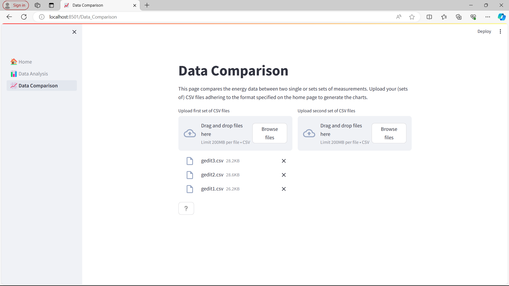
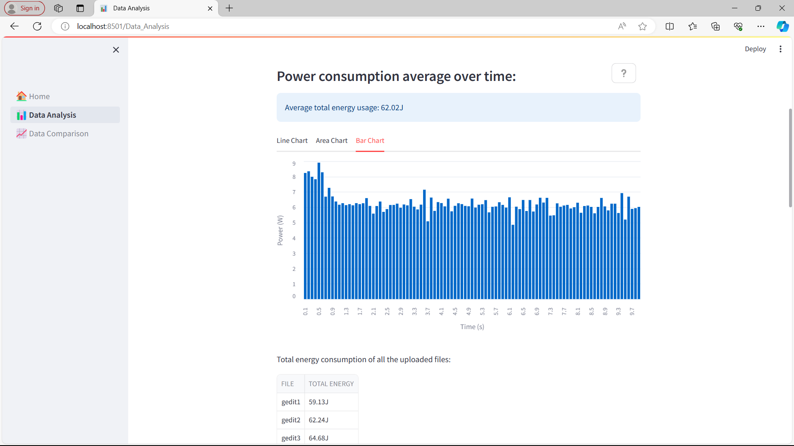
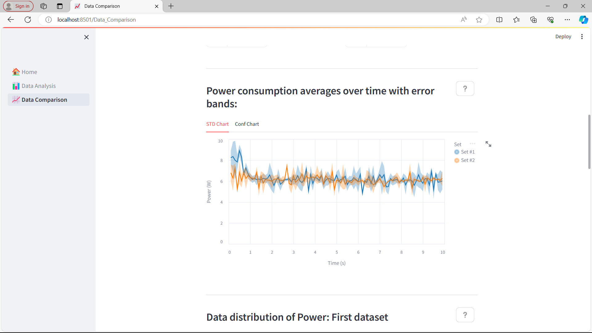
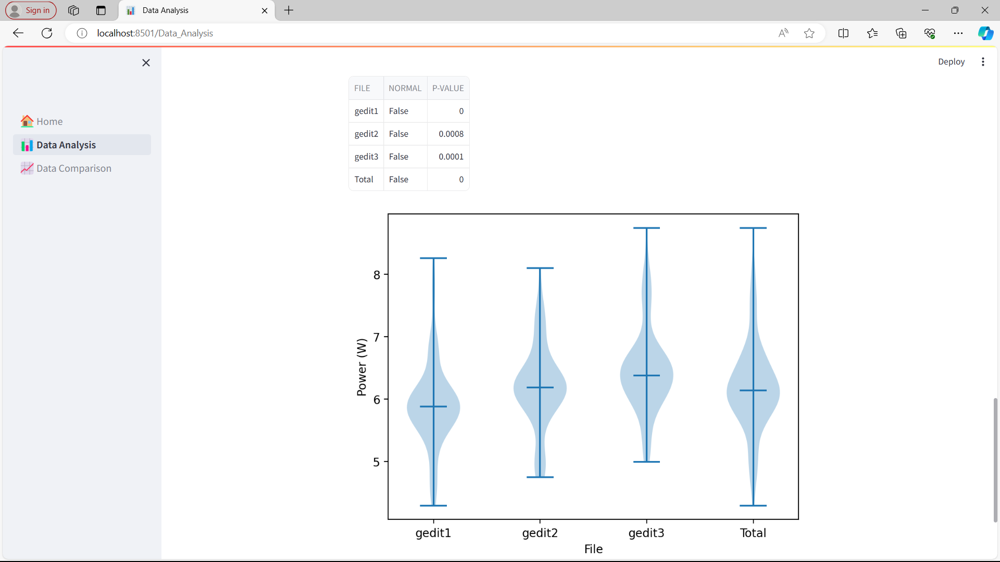
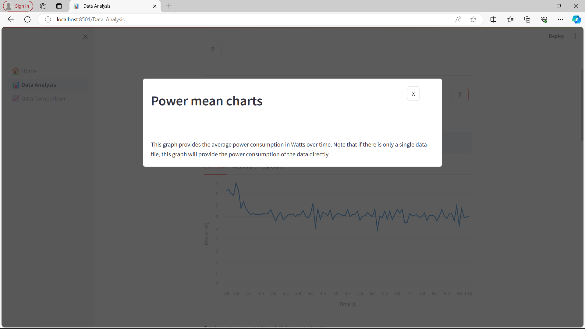

# EnergiReporter
EnergiReporter is an open-source app built for analyzing energy data files, 
specifically those of [EnergiBridge](https://github.com/tdurieux/energibridge).
EnergiReporter offers data analysis reports and data comparison reports for single or multiple 
files. Select a data visualization option from the sidebar to start generating your report!
EnergiReporter is publicly available via Streamlit [here](https://energi-reporter.streamlit.app/).

Currently, EnergiReporter was designed with the energy data file format of EnergiBridge in mind. 
The uploaded file must be a CSV file with either one of the following columns reporting the 
total energy or power usage: `CPU_POWER (Watts)`, `SYSTEM_POWER (Watts)`, `CPU_ENERGY (J)`, 
or `PACKAGE_ENERGY (J)`. Additionally, it should provide a `Time` column in ms to correctly 
convert the data and display it over time.

Any energy data file with the specified columns can be used to generate reports. If you wish 
to use a different file format, you can change this as the code is open-source. In `reader.py` 
the data retrieval is handled, just add your desired column name to the checks, then it will 
extract the energy and power information from there. If it reports the values in a different 
manner the interpretation should also be added though it should be similar to the other options.

## Installation
To run the application locally, some things must be installed.

### Python
The application was written in Python, this means that Python needs to be installed 
in order to run the application. If it has not been installed already, you can install Python with 
the following link: [Download Python](https://www.python.org/downloads/). During development, 
version 3.11 has been used. Other versions may work, but we do not guarantee anything.

### Pip
Next up, check whether you have pip installed by running the following command in a 
terminal: `pip help`. If this doesn't display an error message, it is installed. 
If it does, you can use this tutorial to download 
pip: [Download pip](https://www.geeksforgeeks.org/how-to-install-pip-on-windows/).

### Requirements
The libraries/packages used are all indicated in the `requirements.txt` file. The 
displayed versions are those used during development. Though again, other versions can work, 
but we do not guarantee anything. You can choose to install the libraries/packages in a 
special environment or not but we would recommend using one, we used 
[virtualenv](https://virtualenv.pypa.io/en/latest/). When in the desired place to install 
the requirements just run `pip install -r requirements.txt`.

### Streamlit
This entire app is built on the Streamlit framework, it will already be installed as part of the 
requirements. Further information and resources on the possibilities of Streamlit and how to use it 
can be found [here](https://docs.streamlit.io/).

## Running the application
To run the application open a terminal, within the environment that has the requirements installed 
and in the main directory. Then run the following command: `streamlit run .\_🏠_Home.py`, this will 
open the application on your localhost, usually on [http://localhost:8501](http://localhost:8501).

Now that the application is running there are 2 pages in which you can generate reports. There is 
the data analysis where you can analyze a singular data file or the average of multiple (related) ones.
Then in the other tab you can upload 2 sets of data where it will compare them with the same 
visualizations and information and more.

Some example data files from EnergiBridge have been provided in the `.\test_files` directory. This 
is just simple energy data from not doing anything (sleep) and from opening gedit (text editor) and 
then waiting in there. You can upload these files and see what the application shows you similar to 
the images displayed in the example usage section below.

## Example usage
Here are some images displaying what EnergiReporter can show for some of the test files 
provided in `.\test_files`:

### Uploading files
Uploading files is easily possible with the simple drag and drop functionality. It also 
allows you to browse your files and upload them that way.

### Power consumption averages
Here the power consumption averages (just the data for a single file) is displayed in various charts 
which can be switched in the tab, here the bar chart is displayed. Additionally, the total energy usage 
of all the files is reported as well as the average of them.

### Power consumption with error bands
If multiple files are uploaded the means are also shown with error bands where the user can select 
std and confidence intervals, std being shown here. This example shows the plot for data comparison, 
but it can also be generated for the data analysis.  

### Data distribution of power
Here the statistics of about the power data of all the files is reported. It shows whether the 
data is likely normally distributed or not as well as a violin plot of it for each file and the total.
Not shown in the image, but right above these distribution statistics the data can be influenced with 
outlier removal adjustable to the users desired amount of standard deviations.

### Help texts
Each section either has links to more resources for further explanation, or we provide it via the 
"information button". This button appears on the top right of sections and clicking it opens an explanation 
of what is shown or performed behind the scenes.

## Authors and acknowledgement
This application was implemented using Python and Streamlit by the following authors:
- Thijs Penning
- Bas Marcelis
- Milan de Koning
